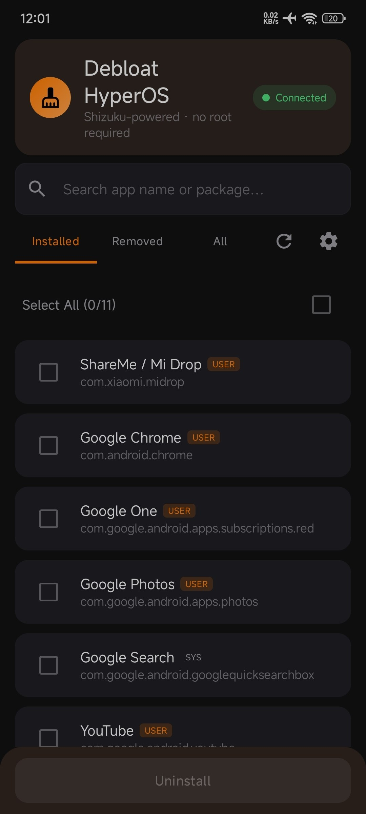
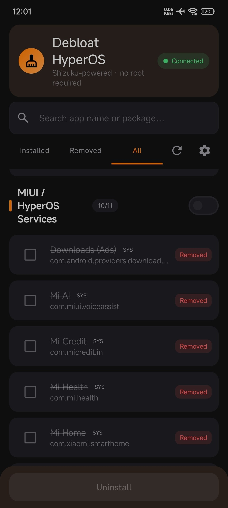
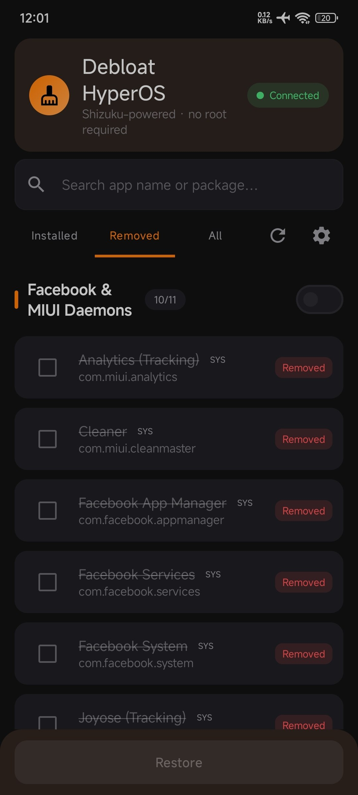

# ⚡ Debloat HyperOS

  

  <b>A modern, safe, and rootless bloatware remover designed specifically for Xiaomi / HyperOS devices.</b>

  
  
  
  

---

## 📱 App Preview

  
  &nbsp;&nbsp;
  
  &nbsp;&nbsp;
  

---

## 💡 Overview

Unlike complicated PC-based command-line scripts or aggressive debloaters, **Debloat HyperOS** provides a native, beautiful Android interface powered by Jetpack Compose to safely manage, disable, and uninstall system bloatware, tracking daemons, and pre-installed packages without triggering bootloops or wiping user partitions.

### ✨ Key Highlights:
* 🛡️ **Zero Root Required:** Operates strictly via the **Shizuku API** using ADB shell permissions (`uid 2000`).
* 🔄 **Fully Reversible:** Uninstalls apps strictly for the current user (`user 0`), allowing instant 1-tap restorations at any time.
* 📑 **Curated Preset Categories:** Packages are categorized safely (MIUI/HyperOS Services, Tracking Daemons, Google Services, Bloatware).
* ⚡ **Bulk Operations:** Select single packages or whole categories to uninstall or restore in batches.
* 🎨 **AMOLED Optimized:** Sleek dark interface inspired by Material 3 and tailored for HyperOS aesthetics.

---

## 🛠️ Architecture & Tech Stack

| Component | Technology |
| :--- | :--- |
| **Language** | Kotlin 100% |
| **UI Framework** | Jetpack Compose + Material 3 Components |
| **System Operations** | [Shizuku API](https://github.com/RikkaApps/Shizuku) (`dev.rikka.shizuku:api:13.1.5`) |
| **Database & Cache** | Android Room Database (`2.6.1`) with Reactive Kotlin Flow |
| **Architecture** | MVVM + Repository Pattern |
| **Serialization** | `kotlinx.serialization` for dynamic preset handling |

---

## 🔄 How It Works

Shizuku acts as a local bridge allowing the app to execute ADB-level Package Manager commands:

[ Debloat HyperOS UI ]
│
▼
[ Shizuku Service ] (ADB Shell / UID 2000)
│
├──► Check State:   pm list packages --user 0
├──► Safe Removal:  pm uninstall --user 0
└──► Quick Restore: cmd package install-existing

1. **State Checking:** Queries package visibility via `pm list packages --user 0 <package>` to verify install status on the fly.
2. **Safe Removal:** Executes `pm uninstall --user 0 <package>` which uninstalls the package only for the active user while keeping system partitions untouched and preserving OEM recovery paths.
3. **Instant Reinstall:** Restores disabled or uninstalled packages instantly using `cmd package install-existing <package>` without downloading external APK files.

---

## 📥 Installation

1. Install **[Shizuku](https://shizuku.rikka.app/)** (v13.0+) and initialize its service via **Wireless Debugging** (Android 11+) or **ADB**.
2. Grab the latest APK from the **[Releases Page](https://github.com/AnasAbdullh/Debloat-HyperOS/releases/latest)** (`DebloatHyperOS-v1.0.0.apk`).
3. Open **Debloat HyperOS**, grant Shizuku binder permissions on first launch, and review recommended presets.

---

## 🤝 Contributing

Contributions, bug fixes, and safety list improvements are welcome! Feel free to submit an issue or open a pull request.

---

## 📄 License

This project is licensed under the [MIT License](LICENSE).